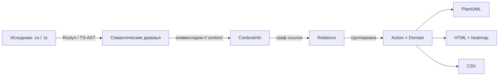
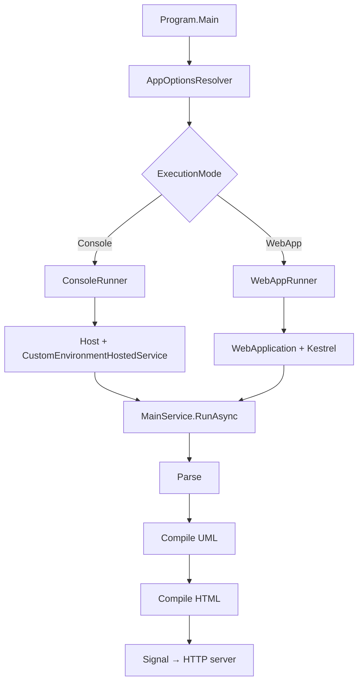

# Обзор проекта

## Что такое ContextBrowser

`ContextBrowser` — консольное + web-приложение, которое превращает исходный
код в **семантическую карту проекта**.

### Поток данных (упрощённо)

```
Исходники .cs / .ts
        │
        ▼
Семантические деревья (Roslyn / TS-AST)
        │
        ▼
ContextInfo (комментарии // context:)
        │
        ▼
Граф ссылок (References / InvokedBy)
        │
        ▼
Группировка в Action × Domain
        │
        ├──► PlantUML   (.puml)
        ├──► HTML       (.html + heatmap)
        └──► CSV        (.csv)
```

Та же схема в mermaid (для GitHub/GitLab/VS Code):



## Из чего состоит

- **12 Kit-ов** — библиотеки, каждая со своей зоной ответственности
- **1 приложение** — `ContextBrowser` (точка входа)
- **2 набора тестов** — `ContextSamples` (примеры) и `ContextBrowserTests` (MSTest)
- **2 внешних сервиса** — HTTP-сервер (`http-server`) и PlantUML picoweb

## Ключевые абстракции

| Понятие | Описание | Где живёт |
|---------|----------|-----------|
| **Context** | тег из комментария `// context: <word>` | `ContextKit` |
| **Action** | глагол: `create/read/update/delete/…` | `ContextClassifier` |
| **Domain** | существительное: `roslyn/uml/graph/…` | `ContextClassifier` |
| **ContextInfo** | класс или метод + набор контекстов | `ContextKit.Model` |
| **Tensor** | пара `Action × Domain` | `TensorKit` |
| **Kit** | библиотека проекта | `Kits/*` |

## Режимы запуска

```
Program.Main
   │
   ▼
AppOptionsResolver
   │
   ▼
ExecutionMode?
   ├── Console ──► ConsoleRunner ──► Host + CustomEnvironmentHostedService
   │                                      │
   └── WebApp  ──► WebAppRunner  ──► WebApplication + Kestrel (порт 5000/5500)
                                          │
                                          ▼
                                    MainService.RunAsync
                                          │
                                          ├─► Parse
                                          ├─► Compile UML
                                          ├─► Compile HTML
                                          └─► Signal → HTTP server
```

В mermaid:



## Внешние зависимости

| Зависимость | Зачем | Версия |
|-------------|-------|--------|
| .NET SDK | runtime | net8.0 |
| Roslyn (`Microsoft.CodeAnalysis.CSharp`) | парсинг C# | 4.11.0 |
| Swashbuckle.AspNetCore | Swagger для WebApp | 6.5.0 |
| Newtonsoft.Json | DeepClone в ContextBrowserKit | 13.0.4 |
| PlantUML picoweb | рендер диаграмм | 1.2025.4 |
| http-server | раздача HTML | npm |

## Дальше читать

- цели → [`01-goals.md`](01-goals.md)
- архитектура → [`10-architecture/`](10-architecture/)
- компоненты → [`30-components/kits.md`](30-components/kits.md)
- для менеджеров → [`managers/index.md`](managers/index.md)