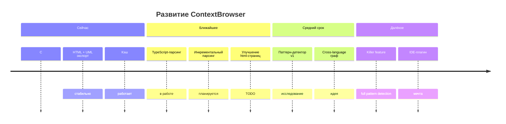

# Цели проекта

## Основная цель

**Автоматический анализ кода на основе авторских комментариев.**

Автор уже знает, что делает его код. Он оставляет метку
`// context: <action>, <domain>` — мы её извлекаем и строим навигацию.

Что это даёт:

- 📍 **Точка входа** в незнакомый модуль за 30 секунд
- 🗺 **Карта действий** (`create/read/update/…`) и их распределения по доменам
- 🔗 **Граф вызовов** без чтения кода
- 📊 **Heatmap покрытия** контекстами (какие места не покрыты)

Целевые языки:

| Язык | Статус |
|------|--------|
| C# / Roslyn | ✅ реализовано |
| TypeScript / Angular | 🚧 планируется |

## Вторичная цель (killer feature)

**Автоматическое выявление паттернов программирования.**

На основе накопленного графа `ContextInfo` + `Relations` можно детектировать:

- **Strategy** — класс с несколькими реализациями одного интерфейса
- **Factory** — метод, возвращающий разные типы по параметру
- **Visitor** — `Accept/Visit` пары
- **Builder** — цепочка методов, возвращающих `this`
- **Composite** — рекурсивная структура с `Children` + `Parent`
- **Observer** — `Subscribe/Notify` пары

Реализуемо **только после того, как основная цель заработает на реальных проектах**
(GULF_Backend, Triton Front, сам ContextBrowser). Горизонт — 6+ месяцев.

## Что НЕ является целью

- ❌ Замена IDE / IntelliSense
- ❌ Code-review автоматизация
- ❌ Статический анализ на баги (для этого есть Roslyn Analyzers)
- ❌ Документация API (для этого есть XML-docs)

## Критерии успеха

| Метрика | Цель |
|---------|------|
| Время до первого отчёта по новому проекту | < 5 минут |
| Покрытие контекстами в целевом проекте | > 60% |
| Точность графа вызовов | > 95% |
| Количество языков | ≥ 2 (C# + TS) |
| Обработка проектов до 1M LOC | без OOM |

## Roadmap (высокоуровневый)

```
Сейчас
  • C#-парсинг                — стабильно
  • HTML + UML экспорт        — стабильно
  • Кэш                       — работает

Ближайшее
  • TypeScript-парсинг        — в работе
  • Инкрементальный парсинг   — планируется
  • Улучшение html-страниц    — TODO

Средний срок
  • Паттерн-детектор v1       — исследование
  • Cross-language граф       — идея

Далёкое
  • Killer feature (full pattern detection)
  • IDE-плагин (мечта)
```

Та же идея в mermaid (timeline):



Подробный статус — [`release/`](release/).