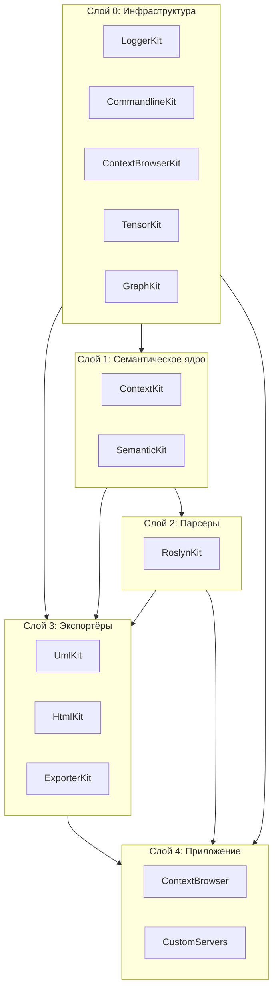
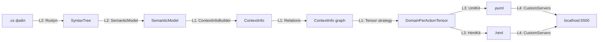

# Слои и связность

## Общая картина

Проект разбит на **5 слоёв** по уровням абстракции и **12 Kit-ов** по зонам ответственности.

### Слои (ASCII)

```
┌────────────────────────────────────────────────────────────────┐
│  L4. Приложение                                                │
│      ContextBrowser, CustomServers                             │
├────────────────────────────────────────────────────────────────┤
│  L3. Экспортёры                                                │
│      UmlKit, HtmlKit, ExporterKit                              │
├────────────────────────────────────────────────────────────────┤
│  L2. Парсеры                                                   │
│      RoslynKit                                                 │
├────────────────────────────────────────────────────────────────┤
│  L1. Семантическое ядро                                        │
│      ContextKit, SemanticKit                                   │
├────────────────────────────────────────────────────────────────┤
│  L0. Инфраструктура                                            │
│      LoggerKit, CommandlineKit, ContextBrowserKit,             │
│      TensorKit, GraphKit                                       │
└────────────────────────────────────────────────────────────────┘
```

Стрелка зависимости: **сверху вниз**. Верхний слой знает о нижнем,
нижний о верхнем — нет.

Та же схема в mermaid (для GitHub/GitLab/VS Code):



## Что каждый слой знает о других

| Слой | Знает о | НЕ знает о |
|------|---------|-----------|
| L0 Инфра | ничего, кроме .NET BCL | о контекстах, о парсинге |
| L1 Семантика | L0 | о Roslyn, о Uml/Html |
| L2 Парсеры | L0, L1 | об экспорте |
| L3 Экспорт | L0, L1 | о Roslyn/TS-специфике (только интерфейсы) |
| L4 Приложение | всё | — |

**Ключевое правило:** L3 (экспортёры) работает **только с `IContextInfo` / `ContextInfo`**,
никогда с `RoslynSyntaxTree` напрямую. Это позволяет добавить TypeScript-парсер без правок в UmlKit/HtmlKit.

## Потоки данных по слоям

### ASCII

```
   .cs файл
      │
      ▼
   ┌─────────────────────────────────────────┐
   │  L2: Roslyn                             │
   │  SyntaxTree → SemanticModel             │
   └─────────────────────────────────────────┘
      │
      ▼
   ┌─────────────────────────────────────────┐
   │  L1: ContextInfoBuilder                 │
   │  SemanticModel → ContextInfo            │
   └─────────────────────────────────────────┘
      │
      ▼
   ┌─────────────────────────────────────────┐
   │  L1: Relations                          │
   │  ContextInfo → ContextInfo graph        │
   └─────────────────────────────────────────┘
      │
      ▼
   ┌─────────────────────────────────────────┐
   │  L1: Tensor strategy                    │
   │  ContextInfo graph → DomainPerAction    │
   └─────────────────────────────────────────┘
      │
      ├────────────────┬────────────────┐
      ▼                ▼                ▼
   ┌────────┐      ┌────────┐       ┌────────┐
   │UmlKit  │      │HtmlKit │       │Csv     │
   │→ .puml │      │→ .html │       │→ .csv  │
   └────────┘      └────────┘       └────────┘
      │                │
      └────────┬───────┘
               ▼
   ┌─────────────────────────────────────────┐
   │  L4: CustomServers                      │
   │  localhost:5500  (HTML)                 │
   │  localhost:8081  (PlantUML picoweb)     │
   └─────────────────────────────────────────┘
```

### Mermaid



## Технические характеристики

| Слой | LOC (прим.) | Test coverage | Bus factor |
|------|-------------|---------------|------------|
| L0 | ~2500 | низкое | 1 |
| L1 | ~3000 | среднее | 1 |
| L2 | ~2500 | среднее | 1 |
| L3 | ~3500 | низкое | 1 |
| L4 | ~1500 | низкое | 1 |

> ⚠️ **Bus factor = 1 на все слои.** См. [`managers/index.md`](../managers/index.md).

## Куда добавлять новую функциональность

| Хочешь добавить | Иди в |
|-----------------|-------|
| Новый язык парсинга | `SemanticKit` + новый Kit (напр. `TypeScriptKit`) |
| Новый тип диаграммы | `UmlKit.Builders` + `ExporterKit.Uml.DiagramCompiler` |
| Новую страницу HTML | `HtmlKit.Builders` + `ExporterKit.Html.Pages` |
| Новую стратегию раскладки в тензор | `ContextKit.WordTensorBuildStrategy` |
| Новый способ сохранения контекста | `ContextKit.CacheManager` |

## Почему именно так

Разбиение на слои — не украшение, а инструмент. Оно решает три задачи:

1. **Изоляция языков.** L3 не знает, откуда пришёл `ContextInfo` — из C#, TS или Python.
   Можно добавить новый парсер без правок в экспортёрах.

2. **Тестируемость.** L1 (семантика) можно тестировать на in-memory данных,
   без файлов и компилятора.

3. **Замена технологий.** Roslyn можно заменить на что угодно, если оно
   реализует интерфейсы `SemanticKit`. Экспорт не заметит.