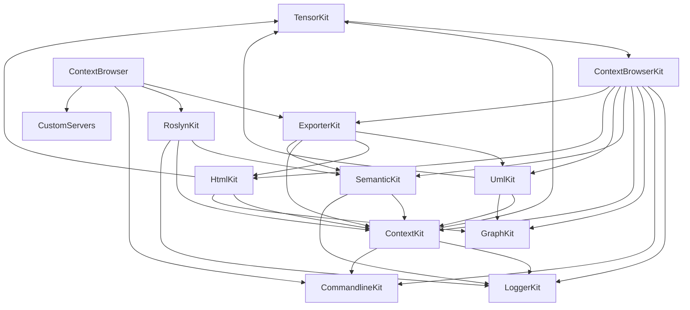

# Правила зависимостей

## Карта зависимостей между Kit-ами

### ASCII

```
                        ┌───────────────────────┐
                        │     TensorKit         │  ← самый нижний
                        └───────────┬───────────┘
                                    │
                        ┌───────────▼───────────┐
                        │   ContextBrowserKit   │
                        └───────────┬───────────┘
                                    │
              ┌─────────────────────┼─────────────────────┐
              │                     │                     │
              ▼                     ▼                     ▼
        ┌──────────┐         ┌───────────┐         ┌───────────┐
        │LoggerKit │         │Commandline│         │ GraphKit  │
        └────┬─────┘         └─────┬─────┘         └─────┬─────┘
             │                     │                     │
             └──────────┬──────────┴──────────┬──────────┘
                        │                     │
                        ▼                     ▼
                ┌───────────────┐     ┌───────────────┐
                │  ContextKit   │     │  SemanticKit  │
                └───────┬───────┘     └───────┬───────┘
                        │                     │
                        │                     ▼
                        │             ┌───────────────┐
                        │             │  RoslynKit    │
                        │             └───────┬───────┘
                        │                     │
              ┌─────────┴─────────┐           │
              │                   │           │
              ▼                   ▼           ▼
        ┌──────────┐        ┌──────────┐  ┌───────────┐
        │  UmlKit  │        │ HtmlKit  │  │(nothing)  │
        └────┬─────┘        └────┬─────┘  └───────────┘
             │                   │
             └─────────┬─────────┘
                       │
                       ▼
                ┌───────────────┐
                │  ExporterKit  │
                └───────┬───────┘
                        │
                        ▼
                ┌───────────────┐
                │ ContextBrowser│  ← приложение
                └───────────────┘
                        ▲
                        │
                ┌───────┴───────┐
                │ CustomServers │  ← изолирован
                └───────────────┘
```

### Mermaid



## Правила (проверять перед PR)

1. **Циклов нет.** Если появляется цикл — значит, один из Kit-ов должен быть
   понижен в слое или выделен в новый.

2. **`TensorKit` — самый нижний.** Не должен зависеть ни от кого, кроме .NET BCL.

3. **`LoggerKit` и `CommandlineKit` — почти низ.**
   Зависят только от `ContextBrowserKit`.

4. **`ContextKit` не знает про Roslyn.**
   Только про `ContextBrowserKit` + `TensorKit`.

5. **`UmlKit` / `HtmlKit` не знают про конкретный язык.**
   Только про `ContextKit`.

6. **`RoslynKit` не знает про Uml/Html.**
   Только про `SemanticKit` + `ContextKit`.

7. **`ExporterKit` знает и про Uml, и про Html, и про Semantic.**
   Он — оркестратор.

8. **`ContextBrowser` — единственный, кто знает про DI-контейнер.**

9. **`CustomServers` изолирован.**
   Зависит только от BCL, ничего из Kits.

## Исключения

- `ContextBrowserKit` содержит `DeepClone` через `Newtonsoft.Json` —
  легаси, есть в плане рефактор (см. [`release/todo.md`](../release/todo.md)).
- `ContextSamples` — тестовый проект, ничего не должен тянуть из production-кода.

## Как проверить

Открыть `.csproj` любого Kit-а и посмотреть `ProjectReference`:

```sh
# Windows
findstr /S "ProjectReference" Kits\*\*.csproj

# Linux / macOS
grep -r "ProjectReference" Kits/*/*.csproj
```

Перед добавлением нового reference — сверить с диаграммой выше.

## Ловушки

| Симптом | Причина | Что делать |
|---------|---------|------------|
| Циклическая зависимость build-time | Кто-то добавил reference «вверх» по слоям | Выделить интерфейс в нижний слой |
| `UmlKit` требует `RoslynKit` | Использование `ISyntaxTree` в builder-е | Ввести промежуточный DTO |
| `ContextKit` требует `LoggerKit` — ok | Так и задумано | — |
| `HtmlKit` требует `UmlKit` | Смешение экспортёров | HtmlKit и UmlKit не знают друг о друге |

## Что делать, если нужен общий код

Если двум Kit-ам нужен общий тип — есть три варианта:

1. **Интерфейс в нижний слой.** Если тип концептуально «низкий»
   (напр. `ILabeledValue`), он должен жить в `ContextKit` или `TensorKit`.

2. **Ввести новый Kit.** Если тип специфичен для пары Kit-ов
   (напр. `PumlInjectionType` для Uml+Html), можно выделить mini-Kit.

3. **Оставить дублирование.** Если тип тривиален (2 поля), дублирование
   дешевле, чем новый слой абстракции.