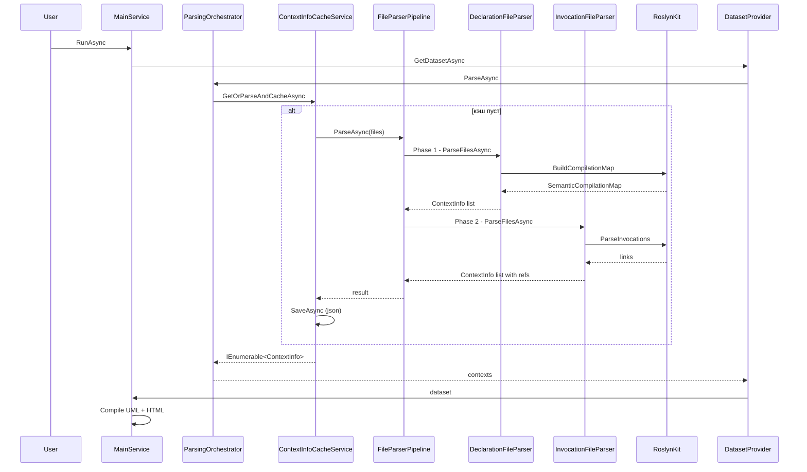
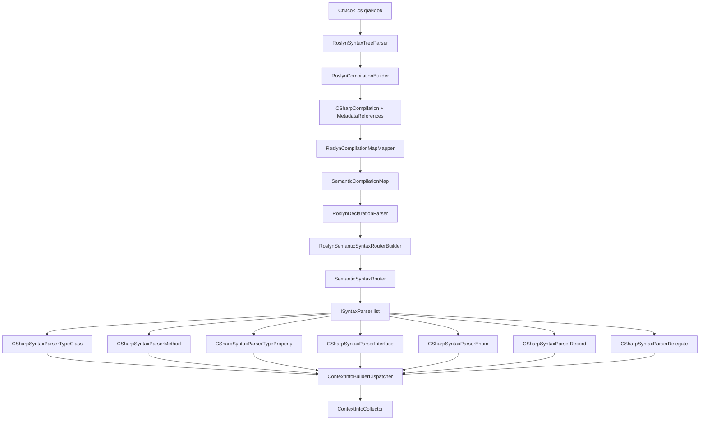
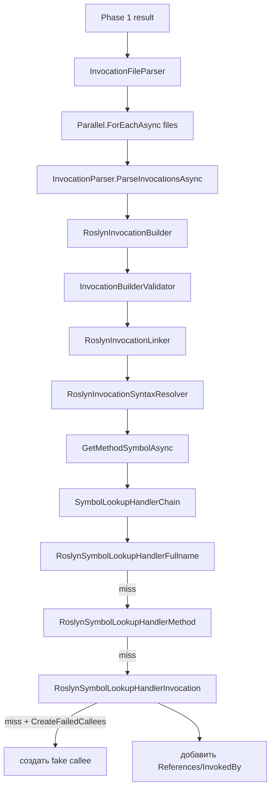
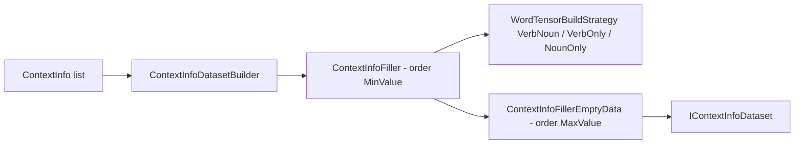
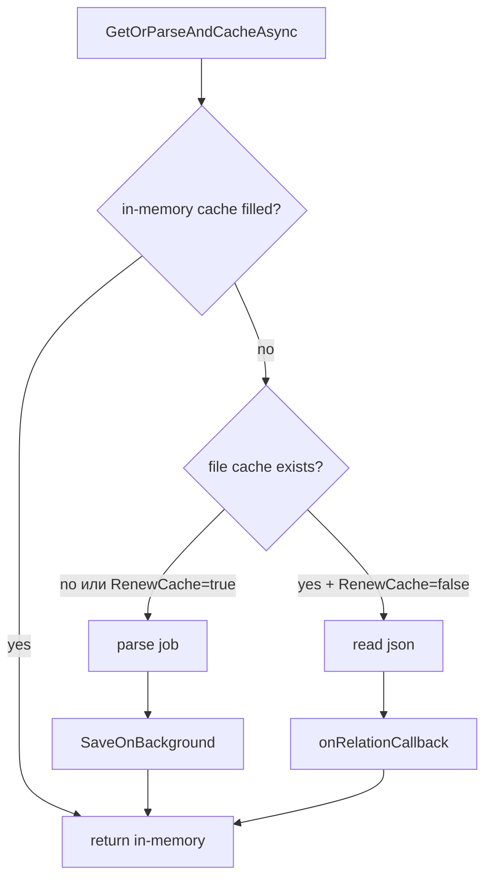

# Pipeline парсинга

## Полный путь от файла до отчёта

### ASCII

```
   Пользователь
       │
       ▼
   ┌──────────────────────────────────────────────────┐
   │  MainService.RunAsync                            │
   └────────┬─────────────────────────────────────────┘
            │
            ▼
   ┌──────────────────────────────────────────────────┐
   │  ContextInfoDatasetProvider.GetDatasetAsync      │
   └────────┬─────────────────────────────────────────┘
            │
            ▼
   ┌──────────────────────────────────────────────────┐
   │  ParsingOrchestrator.ParseAsync                  │
   └────────┬─────────────────────────────────────────┘
            │
            ▼
   ┌──────────────────────────────────────────────────┐
   │  ContextInfoCacheService.GetOrParseAndCacheAsync │
   │  ┌──────────────────────────────────────┐        │
   │  │  кэш пуст?                           │        │
   │  │  ├── да:  FileParserPipeline         │        │
   │  │  └── нет: return cache               │        │
   │  └──────────────────────────────────────┘        │
   └────────┬─────────────────────────────────────────┘
            │
            ▼
   ┌──────────────────────────────────────────────────┐
   │  FileParserPipeline (SortedList<int,IFileParser>)│
   │  ┌──────────────────────────────────────────┐    │
   │  │  Phase 1: DeclarationFileParser          │    │
   │  │    └── RoslynKit → ContextInfoBuilder    │    │
   │  ├──────────────────────────────────────────┤    │
   │  │  Phase 2: InvocationFileParser           │    │
   │  │    └── RoslynInvocationBuilder           │    │
   │  └──────────────────────────────────────────┘    │
   └────────┬─────────────────────────────────────────┘
            │
            ▼
   ┌──────────────────────────────────────────────────┐
   │  ContextInfoDatasetBuilder.BuildAsync            │
   │  ├── ContextInfoFiller (order MinValue)          │
   │  └── ContextInfoFillerEmptyData (order MaxValue) │
   └────────┬─────────────────────────────────────────┘
            │
            ▼
   ┌──────────────────────────────────────────────────┐
   │  MainService                                     │
   │  ├── CompileAllAsync (UML)                       │
   │  ├── CompileAllAsync (HTML)                      │
   │  └── serverStartSignal.Signal()                  │
   └──────────────────────────────────────────────────┘
```

### Mermaid



## Phase 1 — декларации

Задача: **собрать все классы/методы/свойства** в виде `ContextInfo`.

### ASCII

```
   Список .cs файлов
        │
        ▼
   RoslynSyntaxTreeParser
        │
        ▼
   RoslynCompilationBuilder
        │
        ▼
   CSharpCompilation + MetadataReferences
        │
        ▼
   RoslynCompilationMapMapper
        │
        ▼
   SemanticCompilationMap
        │
        ▼
   RoslynDeclarationParser
        │
        ▼
   RoslynSemanticSyntaxRouterBuilder
        │
        ▼
   SemanticSyntaxRouter
        │
        ├── CSharpSyntaxParserTypeClass
        ├── CSharpSyntaxParserMethod
        ├── CSharpSyntaxParserProperty
        ├── CSharpSyntaxParserInterface
        ├── CSharpSyntaxParserEnum
        ├── CSharpSyntaxParserRecord
        └── CSharpSyntaxParserDelegate
                │
                ▼
   ContextInfoBuilderDispatcher
                │
                ▼
   ContextInfoCollector
```

### Mermaid



**Что собирается:**

- `FullName`, `Namespace`, `ShortName`
- `ElementType` (class/method/property/...)
- `ElementVisibility` (public/private/...)
- `ClassOwner`, `MethodOwner`
- `Contexts` (из `// context:` комментариев)
- `Action`, `Domains` (классификация через `ContextClassifier`)

## Phase 2 — вызовы

Задача: **построить граф `References` / `InvokedBy`** между методами.

### ASCII

```
   Phase 1 result
        │
        ▼
   InvocationFileParser
        │
        ▼
   Parallel.ForEachAsync(files)
        │
        ▼
   InvocationParser.ParseInvocationsAsync
        │
        ▼
   RoslynInvocationBuilder
        │
        ▼
   InvocationBuilderValidator
        │
        ▼
   RoslynInvocationLinker
        │
        ▼
   RoslynInvocationSyntaxResolver
        │
        ▼
   GetMethodSymbolAsync
        │
        ▼
   SymbolLookupHandlerChain
        │
        ├── RoslynSymbolLookupHandlerFullname     (прямой поиск по FullName)
        │        │  miss
        │        ▼
        ├── RoslynSymbolLookupHandlerMethod       (fallback по сигнатуре)
        │        │  miss
        │        ▼
        └── RoslynSymbolLookupHandlerInvocation   (fake callee, если CreateFailedCallees)
                 │
                 ▼
   добавить References / InvokedBy
```

### Mermaid



**Что собирается:**

- Для каждого метода — список вызываемых методов
- Обратные связи `InvokedBy`
- Fake-callee для внешних вызовов (System.*, NuGet и т.д.)

## Phase 3 — построение dataset

После Phase 1+2 мы имеем `IEnumerable<ContextInfo>`. Из него:

### ASCII

```
   ContextInfo list
        │
        ▼
   ContextInfoDatasetBuilder
        │
        ├── ContextInfoFiller (order = int.MinValue)
        │        │
        │        ▼
        │   WordTensorBuildStrategy:
        │   ├── VerbNoun     (priority 1)
        │   ├── VerbOnly     (priority 2)
        │   ├── NounOnly     (priority 2)
        │   └── Unclassified (priority 3)
        │
        └── ContextInfoFillerEmptyData (order = int.MaxValue)
                 │
                 ▼
   IContextInfoDataset<ContextInfo, DomainPerActionTensor>
```

### Mermaid



Каждый `ContextInfo` разворачивается в декартово произведение
`(all-actions) × (all-domains)` и добавляется в ячейки.

## Phase 4 — экспорт

Параллельно запускаются два оркестратора:

- **UML** — `UmlDiagramCompilerOrchestrator` → ~20 `IUmlDiagramCompiler`
- **HTML** — `HtmlCompilerOrchestrator` → 7 `IHtmlPageCompiler`

Оба читают `IContextInfoDataset<ContextInfo, DomainPerActionTensor>`.

### Порядок экспорта

```
   IContextInfoDataset
        │
        ├── UmlDiagramCompilerOrchestrator.CompileAllAsync
        │        │
        │        └── Task.WhenAll(IUmlDiagramCompiler[])
        │
        └── HtmlCompilerOrchestrator.CompileAllAsync
                 │
                 └── foreach compiler: await CompileAsync
```

UML-компиляторы работают параллельно, HTML-компиляторы — последовательно.
HTML последовательно, потому что делят один dataset и пишут в общую папку.

## Cache

### ASCII

```
   GetOrParseAndCacheAsync
        │
        ▼
   in-memory cache filled?
        │
        ├── да: return in-memory
        │
        └── нет
             │
             ▼
        file cache exists?
             │
             ├── да + RenewCache=false: read json
             │       │
             │       ▼
             │   onRelationCallback
             │   (ConvertToContextInfoAsync)
             │       │
             │       ▼
             │   return
             │
             └── нет или RenewCache=true
                  │
                  ▼
             parse job
                  │
                  ▼
             SaveOnBackground
                  │
                  ▼
             return
```

### Mermaid



**Что кэшируется:** `List<ContextInfoSerializableModel>` — плоский список без графа.
Граф (`References`, `InvokedBy`, `Owns`) восстанавливается через
`ContextInfoRelationManager.ConvertToContextInfoAsync` **после** чтения из кэша.

## Сводная таблица Phase

| Phase | Компонент | Что | Параллельно? |
|-------|-----------|-----|--------------|
| 1 | `DeclarationFileParser` | декларации | `Task.WhenAll` по файлам |
| 2 | `InvocationFileParser` | вызовы | `Parallel.ForEachAsync` |
| 3 | `ContextInfoDatasetBuilder` | тензоры | последовательно, filler по order |
| 4a | `UmlDiagramCompilerOrchestrator` | .puml | `Task.WhenAll` |
| 4b | `HtmlCompilerOrchestrator` | .html | последовательно |

## Где искать узкие места

| Симптом | Компонент | Настройка |
|---------|-----------|-----------|
| Медленный парсинг | `InvocationFileParser` | `SemanticOptions.MaxDegreeOfParallelism` |
| Долгая компиляция UML | `UmlDiagramCompilerOrchestrator` | кэш `TransitionDiagramBuilderCache` |
| Большой JSON-кэш | `ContextFileCacheStrategy` | `RenewCache=false` |
| OOM при парсинге | `RoslynAssemblyFetcher` | фильтры `TrustedFilters` / `RuntimeFilters` |