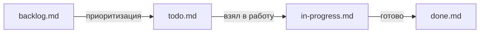

# Статус проекта

Отслеживание работ ведётся иерархично, в четырёх файлах.

## Как это устроено

```
   backlog.md
       │  приоритизация
       ▼
   todo.md
       │  взял в работу
       ▼
   in-progress.md
       │  готово
       ▼
   done.md
```

В mermaid:



## Файлы

| Файл                               | Что внутри                 | Правило обновления                  |
| ---------------------------------- | -------------------------- | ----------------------------------- |
| [`done.md`](done.md)               | Реализовано и работает     | Дописываем в момент merge PR        |
| [`in-progress.md`](in-progress.md) | В работе прямо сейчас      | Обновляем раз в неделю              |
| [`todo.md`](todo.md)               | Запланировано на ближайшее | Обновляем при старте новой итерации |
| [`backlog.md`](backlog.md)         | Идеи, не в приоритете      | Обновляем по вдохновению            |

## Формат записи

Каждый пункт — с номером узла из [mindmap](../40-contexts/mindmap-numbered.md):

```
### <NodeID> <Название>
- **Статус:** done / partial / todo / backlog
- **Ответственный:** @никнейм (или «свободно»)
- **Комментарий:** ...
```

### Пример

```
### 3.1.3.14 UmlTransitionRendererHierarchial
- **Статус:** todo
- **Ответственный:** свободно
- **Комментарий:** заготовка, GetChildrenList возвращает []
```

## Регулярная ревизия

| Когда              | Что делать                                       |
| ------------------ | ------------------------------------------------ |
| Каждый понедельник | актуализировать `in-progress.md`                 |
| Каждый спринт      | пересмотреть `todo.md`                           |
| Раз в квартал      | «чистка» `backlog.md` от умерших идей            |
| Раз в месяц        | показать команде динамику (что перешло в `done`) |

## Как связаны номера и статусы

Номер узла (`NodeID`) всегда берётся из [`40-contexts/mindmap-numbered.md`](../40-contexts/mindmap-numbered.md).
Если узла там ещё нет — сначала добавь в mindmap, потом заводи запись в release.

**Почему так:** mindmap — это карта проекта. Release — это её состояние во времени.
Без карты состояние превращается в хаос.

## Соглашения

- **Не удаляем.** Даже сделанные пункты не удаляем из `done.md` — они служат историей.
- **Не переиспользуем номера.** Удалённые узлы получают метку `(removed)`.
- **Один пункт — один PR.** Если пункт требует много работы, разбиваем на подпункты.
- **Обновляем в PR.** В том же PR, где меняется код, меняется и release-файл.
