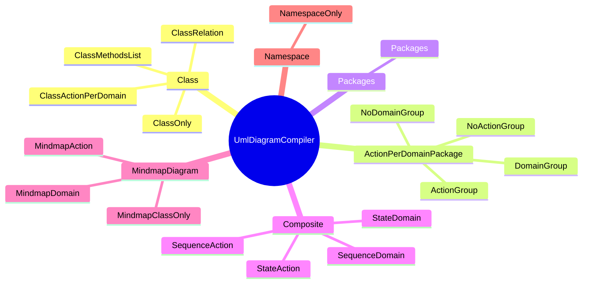
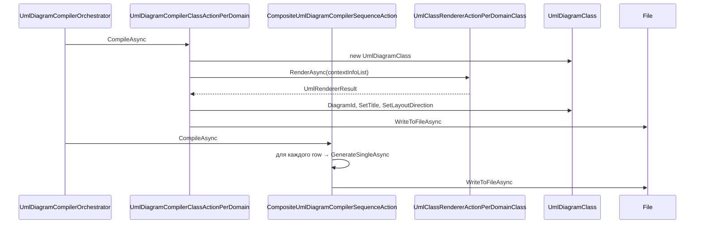
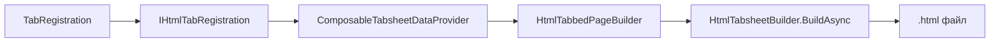
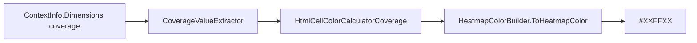

# Экспорт

## Что экспортируется

| Формат         | Куда                                 | Что                                           |
| -------------- | ------------------------------------ | --------------------------------------------- |
| **PlantUML**   | `output/<project>/puml/*.puml`       | class / sequence / state / mindmap / packages |
| **HTML**       | `output/<project>/site/pages/*.html` | матрица + вкладки с диаграммами               |
| **HTML index** | `output/<project>/site/index.html`   | главная матрица                               |
| **CSV**        | (опционально)                        | heatmap counts                                |
| **JSON кэш**   | `output/<project>/cache/roslyn.json` | сериализованные ContextInfo                   |

## UML-экспорт

Реализован в `ExporterKit.Uml` + `UmlKit`. Оркестрируется
`UmlDiagramCompilerOrchestrator` (в `UmlKit.Compiler.Orchestrant`).

### Список компиляторов (≈20)

```
   UmlDiagramCompiler
   │
   ├── Class
   │    ├── ClassActionPerDomain
   │    ├── ClassMethodsList
   │    ├── ClassRelation
   │    └── ClassOnly
   │
   ├── ActionPerDomainPackage
   │    ├── DomainGroup
   │    ├── NoDomainGroup
   │    ├── ActionGroup
   │    └── NoActionGroup
   │
   ├── Packages
   │    └── Packages
   │
   ├── Composite
   │    ├── SequenceAction
   │    ├── SequenceDomain
   │    ├── StateAction
   │    └── StateDomain
   │
   ├── Mindmap
   │    ├── MindmapAction
   │    ├── MindmapClassOnly
   │    └── MindmapDomain
   │
   └── Namespace
        └── NamespaceOnly
```

В mermaid (mindmap):



Каждый реализует `IUmlDiagramCompiler.CompileAsync(CancellationToken)` и
возвращает `Dictionary<ILabeledValue, bool>` — отчёт об успехе.

### Последовательность компиляции



## HTML-экспорт

Реализован в `ExporterKit.Html` + `HtmlKit`. Оркестрируется
`HtmlCompilerOrchestrator`.

### Список компиляторов (7)

| Компилятор                               | Что создаёт                        |
| ---------------------------------------- | ---------------------------------- |
| `HtmlPageCompilerIndexDomainPerAction`   | `index.html` — главная матрица     |
| `HtmlPageCompilerNamespaceOnly`          | `namespace_only_<ns>.html`         |
| `HtmlPageCompilerClassOnly`              | `class_only_<class>.html`          |
| `HtmlPageCompilerActionPerDomain`        | `composite_<action>_<domain>.html` |
| `HtmlPageCompilerActionOnly`             | `composite_action_<action>.html`   |
| `HtmlPageCompilerDomainOnly`             | `composite_domain_<domain>.html`   |
| `HtmlPageCompilerActionPerDomainSummary` | `summary.html`                     |

### Структура HTML-страницы

Каждая страница — вкладки (tabs). Вкладки собираются через
`TabRegistration.For<TContract, DTO>(...)`.

### ASCII

```
   TabRegistration
        │
        ▼
   IHtmlTabRegistration
        │
        ▼
   ComposableTabsheetDataProvider
        │
        ▼
   HtmlTabbedPageBuilder
        │
        ▼
   HtmlTabsheetBuilder.BuildAsync
        │
        ▼
   .html файл
```

### Mermaid



Типовые вкладки для ActionOnly-страницы:

- **Classes** — class-диаграмма (PUML)
- **Methods** — список методов (таблица)
- **States** — state-диаграмма
- **Sequence** — sequence-диаграмма
- **Mindmap** — mindmap

### Heatmap

Значение `coverage` из `Dimensions["coverage"]` участвует в раскраске ячеек:

### ASCII

```
   ContextInfo.Dimensions["coverage"]
        │
        ▼
   CoverageValueExtractor
        │
        ▼
   HtmlCellColorCalculatorCoverage
        │
        ▼
   HeatmapColorBuilder.ToHeatmapColor
        │
        ▼
   "#XXFFXX"
```

### Mermaid



Формула: `channel = 255 * (100 - pct) / 100`, `G = 255`. Крайние значения:

- `0%` → `null` (без заливки)
- `100%` → `#00FF00` (ярко-зелёный)

## PlantUML-рендер

Итоговые `.puml` рендерятся в SVG через локальный сервер:

- **picoweb** — `java -jar plantuml-1.2025.4.jar -picoweb` (порт 8081)
- **Docker** — `plantuml/plantuml-server:jetty` с настройками для больших диаграмм

HTML-страницы содержат `<render-plantuml src="..." server="...">` —
custom element, который делает `POST` в picoweb и вставляет SVG.

Скрипт — `CustomServers/Infrastructure/Picoweb/render-plantuml.js`.

### Схема рендера

```
   HTML-страница
        │
        ▼
   <render-plantuml src="..." server="...">
        │
        ▼
   fetch(server + "/svg/", POST, body=puml)
        │
        ▼
   PlantUML picoweb (localhost:8081)
        │
        ▼
   SVG
        │
        ▼
   вставка в HTML
```

## Настройки экспорта

`AppOptions.Export` (`ExportOptions`):

| Поле           | Что                                                          |
| -------------- | ------------------------------------------------------------ |
| `ExportMatrix` | настройки матрицы (priority, orientation, summary placement) |
| `FilePaths`    | куда писать файлы                                            |
| `WebPaths`     | URL-префиксы для HTML-ссылок                                 |
| `PumlOptions`  | `reference` vs `inject`                                      |

`FilePaths.OutputDirectory` — корень экспорта. Все относительные пути
разрешаются через `ExportFilePaths.BuildAbsolutePath(...)`.

### PumlInjectionType

| Значение    | Что делает                                     |
| ----------- | ---------------------------------------------- |
| `reference` | В HTML вставляется ссылка на `.puml` файл      |
| `inject`    | Содержимое `.puml` вставляется в HTML напрямую |

`reference` даёт меньший HTML, но требует, чтобы picoweb имел доступ к файлу.
`inject` — самодостаточен, но HTML получается большой.

## Где в коде

| Компонент             | Файл                                                      |
| --------------------- | --------------------------------------------------------- |
| UML оркестратор       | `Kits/UmlKit/Compiler/UmlDiagramCompilerOrchestrator.cs`  |
| UML компиляторы       | `Kits/ExporterKit/Uml/DiagramCompiler/`                   |
| HTML оркестратор      | `Kits/ExporterKit/Html/Pages/HtmlCompilerOrchestrator.cs` |
| HTML компиляторы      | `Kits/ExporterKit/Html/Pages/CoCompiler/`                 |
| HTML writer           | `Kits/HtmlKit/Document/HtmlTensorWriter.cs`               |
| PlantUML спецификация | `Kits/UmlKit/PlantUmlSpecification/`                      |
| Heatmap               | `Kits/HtmlKit/Helpers/HeatmapColorBuilder.cs`             |