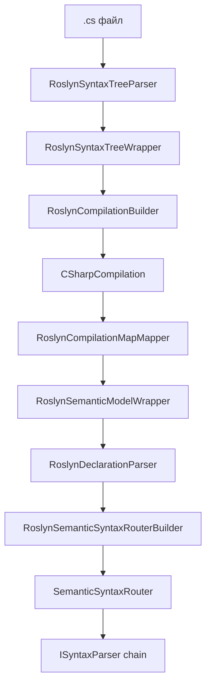
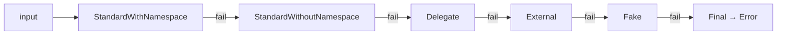

# Парсинг

## C# — реализовано

Парсинг реализован через **Roslyn** (`Microsoft.CodeAnalysis.CSharp` 4.11).

### Компоненты

### ASCII

```
   .cs файл
      │
      ▼
   RoslynSyntaxTreeParser
      │
      ▼
   RoslynSyntaxTreeWrapper
      │
      ▼
   RoslynCompilationBuilder
      │
      ▼
   CSharpCompilation
      │
      ▼
   RoslynCompilationMapMapper
      │
      ▼
   RoslynSemanticModelWrapper
      │
      ▼
   RoslynDeclarationParser
      │
      ▼
   RoslynSemanticSyntaxRouterBuilder
      │
      ▼
   SemanticSyntaxRouter
      │
      ▼
   ISyntaxParser chain (по типу узла)
```

### Mermaid



### Компиляция

Для корректной работы semantic model нужно собрать **CSharpCompilation**:

1. Собрать синтаксические деревья из файлов
2. Собрать `MetadataReference` из трёх источников:
   - **Trusted Platform Assemblies** (`AppContext.GetData("TRUSTED_PLATFORM_ASSEMBLIES")`)
   - **Current Domain** (`AssemblyLoadContext.Default.Assemblies`)
   - **Runtime Directory** (`Directory.GetFiles(runtimeDir, "*.dll")`)
3. Отфильтровать по `FilterPatterns` (trusted / domain / runtime)
4. Добавить `GlobalUsings` (настраивается)
5. Создать `CSharpCompilation`

### Источники сборок (визуально)

```
   ┌──────────────────────────────────┐
   │  Trusted Platform Assemblies     │  ← AppContext.GetData
   └──────────────┬───────────────────┘
                  │
   ┌──────────────▼───────────────────┐
   │  Current Domain Assemblies       │  ← AssemblyLoadContext.Default
   └──────────────┬───────────────────┘
                  │
   ┌──────────────▼───────────────────┐
   │  Runtime Directory (*.dll)       │  ← Directory.GetFiles
   └──────────────┬───────────────────┘
                  │
                  ▼
   ┌──────────────────────────────────┐
   │  FilterPatterns:                 │
   │    TrustedFilters                │
   │    DomainFilters                 │
   │    RuntimeFilters                │
   └──────────────┬───────────────────┘
                  │
                  ▼
   ┌──────────────────────────────────┐
   │  CSharpCompilation               │
   └──────────────────────────────────┘
```

### Diagnostics

Все диагностики Roslyn собираются, ошибки логируются, но **не останавливают парсинг**.
Смысл: даже если проект не компилируется целиком, мы всё равно извлечём
большую часть контекстов.

| Уровень   | Что делает                                     |
| --------- | ---------------------------------------------- |
| `Error`   | логируется как ошибка, но парсинг продолжается |
| `Warning` | логируется как trace                           |
| Остальное | игнорируется                                   |

### Signature parser

Для вызовов, символ которых не разрешился, работает цепочка regex-парсеров
`CSharpSignatureParserChain`.

### ASCII

```
   input (raw signature)
        │
        ▼
   StandardWithNamespace    ─── fail ───┐
        │                               │
       success                          ▼
        │                        StandardWithoutNamespace ─── fail ───┐
        │                               │                            │
        │                              success                       ▼
        │                               │                    Delegate ─── fail ───┐
        │                               │                            │           │
        │                               │                           success      ▼
        │                               │                            │    External ─── fail ──┐
        │                               │                            │           │             │
        │                               │                            │          success        ▼
        │                               │                            │           │         Fake ── fail ──┐
        │                               │                            │           │             │           │
        │                               │                            │           │            success      ▼
        │                               │                            │           │             │      Final → Error
        │                               │                            │           │             │
        └───────────────────────────────┴────────────────────────────┴───────────┴─────────────┘
                                              │
                                              ▼
                                      SignatureParsingResult
```

### Mermaid



Каждый парсер даёт `SignatureParsingResult` — либо `Success`, либо `Failure`.
Цепочка идёт до первого `Success`.

## TypeScript — планируется

### Что нужно сделать

| Шаг                  | Компонент                               | Статус |
| -------------------- | --------------------------------------- | ------ |
| 1. Parser            | `TypeScriptKit` (новый)                 | 📋      |
| 2. Router builder    | `TypeScriptSemanticSyntaxRouterBuilder` | 📋      |
| 3. Signature parser  | `TypeScriptSignatureParserChain`        | 📋      |
| 4. Selector по языку | `ISyntaxRouterBuilderRegistry`          | ✅ есть |
| 5. Регистрация в DI  | `HostConfigurator`                      | 📋      |

### Инфраструктура уже готова

- `ISyntaxRouterBuilderRegistry<TContext>` — выбирает router по языку
- `CodeParsingOptions.SemanticLanguage` — строка (`"csharp"` / `"angular"`)
- `SemanticSyntaxRouterBuilderRegistry` — уже содержит заглушку для `"angular"`

### Что нужно решить

- Какой TS-парсер использовать: `ts-morph`, `typescript-eslint`, `babel`, `oxc`?
- Внешний процесс (Node.js) или нативный .NET-парсер?
- Как обрабатывать `@Component` / `@Injectable` декораторы (аналог атрибутов)?

Решения см. в [`release/todo.md`](../release/todo.md).

### Планируемая схема

```
   TypeScript (.ts)
        │
        ▼
   TypeScriptKit (новый)
        │
        ▼
   SemanticKit (общие интерфейсы — уже есть)
        │
        ▼
   ContextInfo (тот же самый)
        │
        ▼
   Дальше — без изменений (UmlKit, HtmlKit, ExporterKit)
```

## Псевдокод

Флаг `SemanticOptions.IncludePseudoCode` позволяет добавить `using System;`
в файлы без него — для обхода `CS8915`. Реализовано в `RoslynCodeInjector`.

## Известные проблемы

| Проблема                                | Файл                             | Workaround                        |
| --------------------------------------- | -------------------------------- | --------------------------------- |
| `CS8915` при отсутствии `using System;` | `RoslynCodeInjector`             | включать `IncludePseudoCode`      |
| Не все символы разрешаются              | `RoslynSymbolLookupHandler*`     | цепочка fallback-ов + fake callee |
| Сложные generic-имена                   | `CSharpSignatureParserStandard*` | балансирующие группы в regex      |

## Где в коде

| Компонент       | Файл                                                       |
| --------------- | ---------------------------------------------------------- |
| Загрузка сборок | `Kits/RoslynKit/Assembly/RoslynAssemblyFetcher.cs`         |
| Компиляция      | `Kits/RoslynKit/Assembly/RoslynCompilationBuilder.cs`      |
| Парсинг дерева  | `Kits/RoslynKit/Assembly/RoslynSyntaxTreeParser.cs`        |
| Semantic model  | `Kits/RoslynKit/Model/Meta/RoslynSemanticModelWrapper.cs`  |
| Парсеры узлов   | `Kits/RoslynKit/Syntax/Parsers/`                           |
| Signature chain | `Kits/RoslynKit/Signature/SignatureParser/`                |
| Lookup-цепочка  | `Kits/RoslynKit/Lookup/`                                   |
| Оркестратор     | `Kits/SemanticKit/Parsers/Strategy/ParsingOrchestrator.cs` |