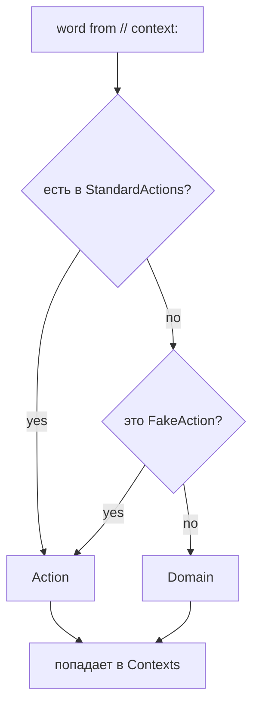
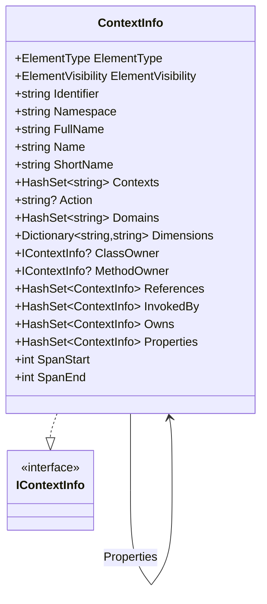

# Модель контекста

## Что такое контекст

Комментарий автора кода, начинающийся со специального префикса:

```csharp
// context: create, loader, validation
public class Loader { … }
```

- Префикс — **`context:`** (регистр не важен)
- Значения — через запятую или `;`
- Каждое значение приводится к `lowercase`

## Классификация

Каждое значение классифицируется как `Action` или `Domain`.

### ASCII

```
   слово из // context:
        │
        ▼
   ┌─────────────────────────────────┐
   │  есть в StandardActions?        │
   │  create/read/update/delete/     │
   │  validate/share/build/model/    │
   │  execute/convert                │
   └────────────┬────────────────────┘
                │
        ┌───────┴───────┐
        │               │
       да              нет
        │               │
        ▼               ▼
   ┌─────────┐   ┌─────────────────┐
   │ Action  │   │ это FakeAction? │
   └────┬────┘   └────────┬────────┘
        │                 │
        │         ┌───────┴───────┐
        │         │               │
        │        да              нет
        │         │               │
        │         ▼               ▼
        │    ┌─────────┐    ┌──────────┐
        │    │ Action  │    │  Domain  │
        │    └────┬────┘    └────┬─────┘
        │         │              │
        └─────────┴──────────────┘
                  │
                  ▼
           попадает в Contexts
```

### Mermaid



**StandardActions** по умолчанию:

```
create, read, update, delete, validate,
share, build, model, execute, convert
```

**Правило:** если у элемента **есть и action, и хотя бы один domain** — он
«правильно классифицирован» и попадёт в матрицу. Иначе — попадёт в
«неклассифицированные» (`_fakeAction` / `_fakeDomain`), либо вообще не попадёт.

## Модель `ContextInfo`

`ContextInfo` — центральная модель проекта. Всё, что происходит дальше
(граф, тензоры, диаграммы, страницы), — это проекции этого объекта.

### Поля

| Группа            | Поле                    | Смысл                                   |
| ----------------- | ----------------------- | --------------------------------------- |
| **Идентификация** | `Identifier`            | GUID, стабильный ID                     |
|                   | `Namespace`             | namespace элемента                      |
|                   | `FullName`              | полное имя (`Namespace.Class.Method`)   |
|                   | `Name`                  | имя (для методов — с классом)           |
|                   | `ShortName`             | короткое имя (без namespace)            |
| **Тип**           | `ElementType`           | class / method / property / enum / …    |
|                   | `ElementVisibility`     | public / private / protected / internal |
| **Контекст**      | `Contexts`              | все теги из `// context:`               |
|                   | `Action`                | действие (одно)                         |
|                   | `Domains`               | домены (может быть много)               |
|                   | `Dimensions`            | свободный словарь (`coverage`, …)       |
| **Иерархия**      | `ClassOwner`            | класс-владелец (для методов/свойств)    |
|                   | `MethodOwner`           | метод-владелец (для свойств)            |
| **Граф**          | `References`            | вызывает (caller → callee)              |
|                   | `InvokedBy`             | вызывается (обратная)                   |
|                   | `Owns`                  | содержит (parent → child)               |
|                   | `Properties`            | класс → свойства                        |
| **Позиция**       | `SpanStart` / `SpanEnd` | позиция в файле                         |

### Диаграмма классов



## Связи

| Связь         | Смысл                        | Кто ставит                                 |
| ------------- | ---------------------------- | ------------------------------------------ |
| `References`  | caller → callee              | Phase 2 (`RoslynInvocationLinksBuilder`)   |
| `InvokedBy`   | callee → caller (обратная)   | Phase 2                                    |
| `Owns`        | parent → child (по иерархии) | `ContextInfoBuilder.BuildContextInfoAsync` |
| `Properties`  | class → property             | Phase 1 (`CSharpSyntaxParserTypeProperty`) |
| `ClassOwner`  | method → class               | Phase 1                                    |
| `MethodOwner` | property → method            | Phase 1                                    |

### Граф связей (визуально)

```
         ┌───────────────┐
         │ Class A       │
         │ ──────────────│
         │ Method A.Foo()│────── References ────┐
         └───────────────┘                       │
                 │                               │
                 │ Owns                          │
                 ▼                               ▼
         ┌───────────────┐              ┌───────────────┐
         │ Method B.Bar()│◄─ InvokedBy ─│ Class B       │
         │ ──────────────│              │ ──────────────│
         │ (callee)      │              │ Method B.Bar()│
         └───────────────┘              └───────────────┘
```

## Dimensions

Свободный словарь `Dictionary<string, string>` для расширяемых атрибутов.
Заполняется стратегиями из комментариев:

```csharp
// coverage: 12
```

→ `Dimensions["coverage"] = "12"`.

Используется в HTML-экспорте для построения heatmap.

## Специальные значения

| Поле          | Значение      | Что значит                  |
| ------------- | ------------- | --------------------------- |
| `EmptyAction` | `EmptyAction` | у элемента нет action       |
| `EmptyDomain` | `EmptyDomain` | у элемента нет domain       |
| `FakeAction`  | `_fakeAction` | placeholder для «не action» |
| `FakeDomain`  | `_fakeDomain` | placeholder для «не domain» |

Настраиваются через `AppOptions.Classifier` → `DomainPerActionContextTensorClassifier`.

## Как писать контексты (best practice)

| Комментарий                  | Что будет                                     |
| ---------------------------- | --------------------------------------------- |
| `// context: create, roslyn` | ✅ action + domain, классифицируется           |
| `// context: build`          | ⚠️ только action, попадёт в `EmptyDomain`      |
| `// context: uml`            | ⚠️ только domain, попадёт в `EmptyAction`      |
| `// context: foo, bar`       | ⚠️ два domain, без action, `EmptyAction`       |
| `// coverage: 50`            | ✅ только для heatmap, независимо от `context` |

**Идеальный комментарий:** одно action + один-два domain.

## Где в коде

| Компонент          | Файл                                                                |
| ------------------ | ------------------------------------------------------------------- |
| Модель             | `Kits/ContextKit/Model/ContextInfo.cs`                              |
| Интерфейсы         | `Kits/ContextKit/Model/IContextInfo.cs`                             |
| Классификатор      | `Kits/ContextKit/Model/Classifier/IContextClassifier.cs`            |
| Разбор комментария | `Kits/ContextKit/ContextData/Comment/Stategies/ContextStrategy.cs`  |
| Разбор coverage    | `Kits/ContextKit/ContextData/Comment/Stategies/CoverageStrategy.cs` |