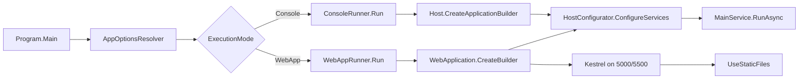
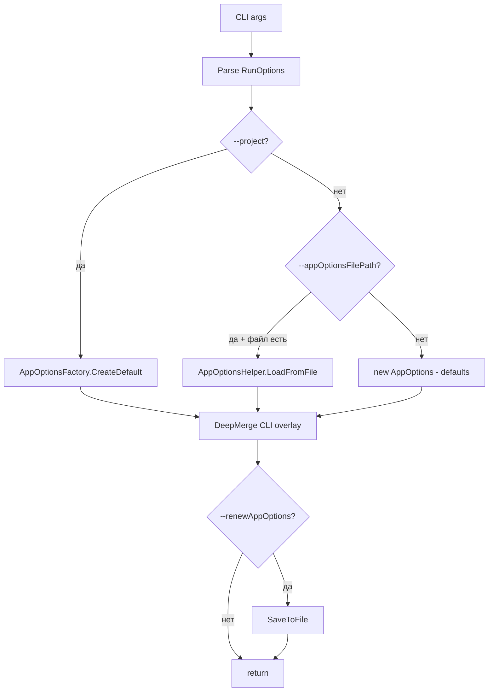

# Приложение ContextBrowser

Точка входа — `ContextBrowser/Program.cs`.

## Структура папок

```
ContextBrowser/
├── Program.cs                         # entry point
├── HostConfigurator.cs                # DI-конфигурация (260 строк)
├── Infrastructure/
│   ├── ConsoleRunner.cs               # режим Console
│   ├── WebAppRunner.cs                # режим WebApp
│   ├── ContextInfoFlatMapperFactory.cs
│   ├── ContextInfoMapperFactory.cs
│   └── Options/
│       ├── AppOptions.cs
│       ├── AppOptionsResolver.cs
│       ├── AppOptionsHelper.cs
│       ├── RunOptions.cs
│       ├── JsonConverters/
│       └── Projects/AppOptionsFactory.cs
├── Services/
│   ├── MainService.cs                 # корневой RunAsync
│   ├── AppSettingsStore.cs            # IAppOptionsStore
│   ├── CustomEnvironmentHostedService.cs
│   ├── ServerStartSignal.cs
│   ├── ContextInfoProvider/
│   │   ├── BaseContextInfoProvider.cs
│   │   ├── ContextInfoDatasetProvider.cs
│   │   ├── ContextInfoDatasetProviderMethodList.cs
│   │   ├── ContextInfoIndexerProvider.cs
│   │   └── ContextInfoMappingProvider.cs
│   └── Parsing/
│       ├── CommentParsingStrategyFactory.cs
│       └── SemanticSyntaxRouterBuilderRegistry.cs
└── wwwroot/ContextBrowserStartPage.html
```

## Точка входа

```
   Program.Main(args)
        │
        ▼
   AppOptionsResolver.ResolveOptionsAsync
        │
        ▼
   appOptions == null?
        │
        ├── да: Environment.Exit(1)
        │
        └── нет
             │
             ▼
        ExecutionMode?
             │
             ├── Console: ConsoleRunner.Run
             │
             └── WebApp:  WebAppRunner.Run
```

## Режимы запуска

### ASCII

```
   Program.Main
        │
        ▼
   AppOptionsResolver
        │
        ▼
   ExecutionMode?
        │
        ├── Console ──► ConsoleRunner.Run
        │                   │
        │                   ▼
        │              Host.CreateApplicationBuilder
        │                   │
        │                   ▼
        │              HostConfigurator.ConfigureServices
        │                   │
        │                   ▼
        │              MainService.RunAsync
        │
        └── WebApp  ──► WebAppRunner.Run
                            │
                            ▼
                       WebApplication.CreateBuilder
                            │
                            ▼
                       HostConfigurator.ConfigureServices
                            │
                            ▼
                       Kestrel on 5000/5500
                            │
                            ▼
                       UseStaticFiles
```

### Mermaid



## `MainService.RunAsync` — что происходит

1. `optionsStore.GetOptions<ExportOptions>()`
2. `exportOptions.FilePaths.Prepare()` — очистить и создать папки
3. `datasetProvider.GetDatasetAsync(ct)` — распарсить и построить датасет
4. `diagramCompilerOrchestrator.CompileAllAsync(ct)` — все UML
5. `htmlCompilerOrchestrator.CompileAllAsync(ct)` — все HTML
6. `serverStartSignal.Signal()` — разбудить `CustomEnvironmentHostedService`

### Схема

```
   MainService.RunAsync
        │
        ▼
   FilePaths.Prepare()                ← создаёт output/<project>/
        │
        ▼
   GetDatasetAsync()                  ← парсинг + построение датасета
        │
        ▼
   DiagramCompilerOrchestrator        ← ~20 IUmlDiagramCompiler
   .CompileAllAsync()
        │
        ▼
   HtmlCompilerOrchestrator           ← 7 IHtmlPageCompiler
   .CompileAllAsync()
        │
        ▼
   ServerStartSignal.Signal()         ← TaskCompletionSource.SetResult(true)
        │
        ▼
   (CustomEnvironmentHostedService)
     └── RunServers → http-server + picoweb + открытие браузера
```

## `HostConfigurator.ConfigureServices` — что регистрируется

Разбито на блоки:

| Блок         | Что                                                                                       |
| ------------ | ----------------------------------------------------------------------------------------- |
| Общие службы | `IAppOptionsStore`, `IAppLogger`, `INamingProcessor`                                      |
| ContextInfo  | `IContextInfoManager`, `IContextCollector`, `IContextFactory`, `IContextInfoCacheService` |
| Parsing      | `ICodeParseService`, `IParsingOrchestrator`, `SignatureChainFactory`                      |
| Roslyn       | `ISyntaxTreeParser`, `ICompilationBuilder`, `RoslynInvocation*`                           |
| Builders     | ~10 `IContextInfoBuilder<ContextInfo>`                                                    |
| Comment      | `IContextInfoCommentProcessor`, `ICommentParsingStrategyFactory`                          |
| HTML         | ~15 сервисов                                                                              |
| UML          | ~30 сервисов (рендереры, компиляторы, transition builders)                                |

Итого ~100 регистраций. Это **ключевой файл для понимания DI-графа**.

### Порядок регистраций (упрощённо)

```
   1. Общие:      IAppOptionsStore, IAppLogger, INamingProcessor
   2. Context:    IContextInfoManager, IContextCollector, IContextFactory
   3. Cache:      IContextInfoCacheService, IFileCacheStrategy
   4. Parsing:    ICodeParseService, IParsingOrchestrator
   5. Roslyn:     ISyntaxTreeParser, ICompilationBuilder, Roslyn*Converters
   6. Lookup:     ISymbolLookupHandler<T>, ChainFactory
   7. Builders:   CSharpContextInfoBuilder* (10 штук)
   8. Comments:   IContextInfoCommentProcessor, ICommentParsingStrategyFactory
   9. Tensor:     ITensorBuilder, ITensorFactory, ITensorClassifier
  10. Dataset:    IContextInfoDatasetBuilder, IContextInfoFiller
  11. HTML:       IHtmlPageCompiler[] (7), IHtmlTensorWriter, IHtmlHrefManager
  12. UML:        IUmlDiagramCompiler[] (20), IUmlTransitionRenderer*, IUmlTransitionFactory
  13. Orchestr:   IHtmlCompilerOrchestrator, IUmlDiagramCompilerOrchestrator
```

## `AppOptionsResolver` — приоритеты конфигурации

### ASCII

```
   CLI args
        │
        ▼
   Parse RunOptions
        │
        ▼
   --project?
        │
        ├── да: AppOptionsFactory.CreateDefault(project)
        │
        └── нет
             │
             ▼
        --appOptionsFilePath?
             │
             ├── да + файл есть: AppOptionsHelper.LoadFromFile
             │
             └── нет: new AppOptions() — defaults
             │
             ▼
        DeepMerge CLI overlay (--a.b.c value)
             │
             ▼
        --renewAppOptions?
             │
             ├── да: SaveToFile
             │
             └── нет
             │
             ▼
        return
```

### Mermaid



**Приоритет:** preset > файл > дефолт. Поверх — CLI-флаги.

## Preset-проекты

`AppOptionsFactory`:

- `"Gulf"` → парсит `C:\projects\ascon\GULF_Backend`
- `"ContextBrowser"` → парсит сам себя
- иначе → дефолтные настройки

Добавление нового preset:

1. Открыть `Infrastructure/Options/Projects/AppOptionsFactory.cs`
2. Добавить метод `CreateYourProjectOptions()`
3. Добавить case в `switch` в `CreateDefault`

## WebApp режим

- Kestrel, порт из `Export.WebPaths.OutputDirectory` (default 5000)
- Swagger UI на `/swagger`
- Static files из `wwwroot`
- `ContextBrowserStartPage.html` — стартовая страница

При старте — открывает браузер через `Process.Start(new ProcessStartInfo{ UseShellExecute = true, ... })`.

### Схема WebApp

```
   WebAppRunner.Run
        │
        ▼
   WebApplication.CreateBuilder
        │
        ▼
   ConfigureKestrel:
     ListenAnyIP(0)               ← сброс
     Listen(IPAddress.Parse(host))← установка
        │
        ▼
   HostConfigurator.ConfigureServices
        │
        ▼
   AddControllers + Swagger
        │
        ▼
   WebApplication.Build
        │
        ▼
   lifetime.ApplicationStarted.Register:
     Process.Start(startUrl)      ← открытие браузера
        │
        ▼
   UseSwagger (dev) + UseStaticFiles
        │
        ▼
   RunAsync
```

## Где искать ошибку, если…

| Симптом                 | Файл                                                                        |
| ----------------------- | --------------------------------------------------------------------------- |
| Парсинг не идёт         | `SemanticKit/Parsers/CodeParseService.cs`                                   |
| Пустой dataset          | `ContextBrowser/Services/ContextInfoProvider/ContextInfoDatasetProvider.cs` |
| Нет UML                 | `ExporterKit/Uml/DiagramCompiler/UmlDiagramCompilerOrchestrator.cs`         |
| Нет HTML                | `ExporterKit/Html/Pages/HtmlCompilerOrchestrator.cs`                        |
| CLI не парсится         | `CommandlineKit/CommandLineParser.cs`                                       |
| Опции не применяются    | `ContextBrowser/Infrastructure/Options/AppOptionsResolver.cs`               |
| DI не резолвит сервис   | `ContextBrowser/HostConfigurator.cs`                                        |
| Браузер не открывается  | `ContextBrowser/Infrastructure/WebAppRunner.cs`                             |
| HTTP-сервер не стартует | `Kits/CustomServers/CustomEnvironment.cs`                                   |

## Известные проблемы

- ⚠️ `#warning args to be checked` в `ConsoleRunner.cs` и `WebAppRunner.cs`
- ⚠️ `#warning add elementVisibilityParam` в `CSharpSyntaxWrapperInvocation.cs`
- ⚠️ `HostConfigurator.cs` — 260 строк, нужен рефактор на модули